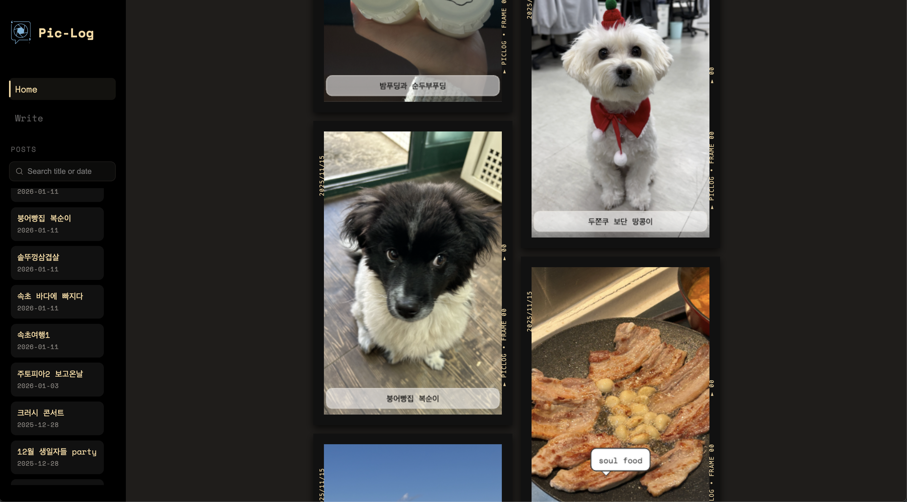
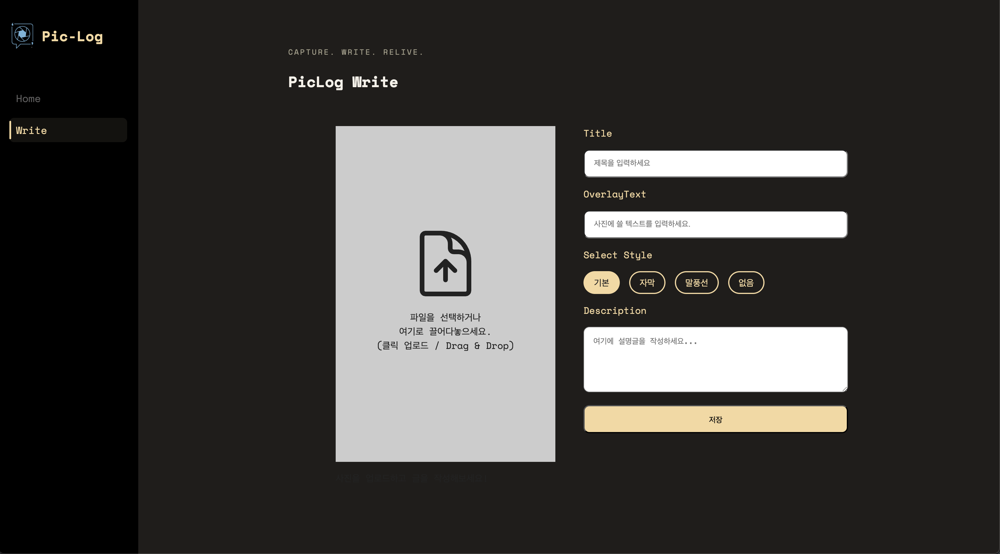
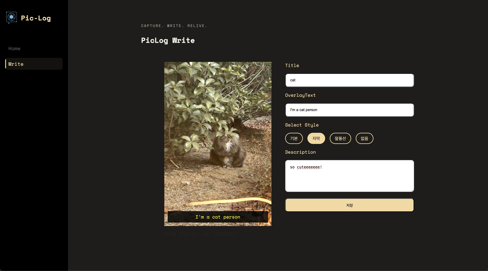
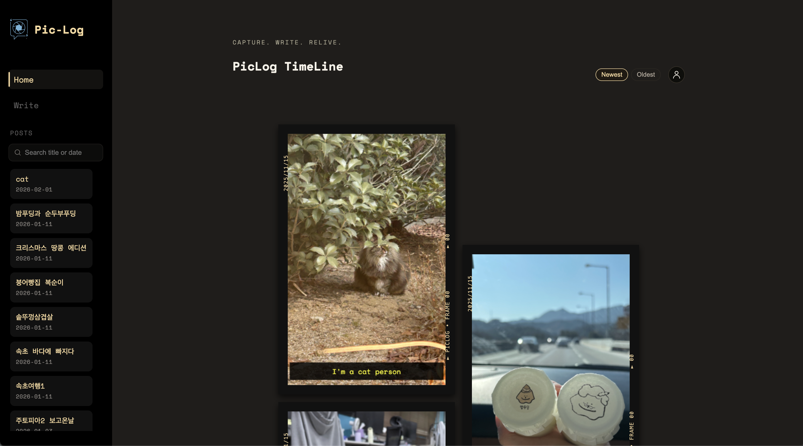

# 📸 PicLog - 개인 추억 보관 SNS

** Capture. Write. Relive. **
사진에 기록을 남기는 개인 아카이브 프로젝트

**PicLog**는 나의 순간들을 사진과 함께 기록하고 피드 형태로 모아볼 수 있는 SNS 입니다.  
여행 중의 한 장면, 일상 속의 소소한 순간까지 —  
사진 위에 텍스트를 덧입혀 나만의 스토리를 만들어갈 수 있습니다.

단순한 이미지 공유가 아닌,  
**‘추억을 시각적으로 남기고 공유하는 경험’**을 목표로 개발되었습니다.

## 🚀 프로젝트 개요

| 항목           | 내용                                                                      |
| -------------- | ------------------------------------------------------------------------- |
| **프로젝트명** | PicLog                                                                    |
| **기간**       | 약 2개월                                                                       |
| **개발 목적**  | 프론트엔드 포트폴리오용 개인 프로젝트                                     |
| **기여도**     | 100% (1인 개발)                                                           |
| **주요 기능**  | 사진 업로드, 오버레이 텍스트, 포스트 저장 및 목록 출력, 무한 스크롤(예정) |

---

## 🧩 기술 개요

### ⚙️ 프로젝트 구조

- **React + TypeScript 기반 컴포넌트 구조 설계**
  - 페이지(`Home`, `Write`) 단위로 사용자 흐름을 먼저 설계
  - 반복되는 UI를 `PhotoList`, `PhotoCard` 등의 컴포넌트로 분리해 관리
- **상태 관리**
  - 기본적으로 `useState`, `useEffect`로 상태 관리
  - 추후 Recoil 도입 예정 (전역 상태 및 다크모드 전환 관리)
- **데이터 저장 구조**
  - `localforage`를 사용해 IndexedDB 기반의 영구 저장
  - 단건 → 다건 저장 구조로 리팩터링하며 `Post[]` 형태로 관리
  - 최신순 정렬 로직을 구현해 최근 저장된 포스트가 먼저 보이도록 처리

---

### 🧠 핵심 기능

- **이미지 업로드 및 미리보기**
  - 사용자가 업로드한 이미지를 미리보기로 표시
  - `html2canvas`를 사용해 오버레이된 사진을 하나의 이미지로 캡처
- **오버레이 텍스트 시스템**
  - `"plain" | "subtitle" | "speech" | "none"` 등 스타일 타입 분리
  - 사용자가 선택한 스타일에 따라 텍스트 디자인 변경
  - TypeScript를 통해 `OverlayType`, `Post` 인터페이스를 분리 관리
- **포스트 저장 및 불러오기**
  - 저장 시 `html2canvas`로 이미지 → URL 변환 후 localforage에 저장
  - Home 화면에서 저장된 포스트들을 불러와 카드 형태로 렌더링

---

### 🧰 개발 환경

| 항목            | 내용                    |
| --------------- | ----------------------- |
| **프레임워크**  | React (CRA 기반)        |
| **언어**        | TypeScript              |
| **스타일링**    | styled-components       |
| **상태 관리**   | useState, useEffect     |
| **스토리지**    | localforage (IndexedDB) |
| **이미지 처리** | html2canvas             |
| **품질 관리**   | ESLint, Prettier        |
| **빌드 도구**   | Create React App        |

---

### 🧱 폴더 구조
```text
src/
├─ assets/ # 이미지 등 정적 리소스
├─ components/ # 재사용 UI 컴포넌트
│ ├─ EmptyState.tsx
│ ├─ FilmColumn.tsx
│ ├─ FilmFrame.tsx
│ ├─ MainHeader.tsx
│ ├─ PhotoCard.tsx
│ ├─ PhotoList.tsx
│ └─ SideBar.tsx
├─ constants/
│ └─ layout.ts # 레이아웃 상수
├─ docs/
│ └─ screens/ # README용 화면 캡처 이미지
├─ hooks/ # 커스텀 훅(추가 확장 포인트)
├─ pages/ # 라우트(화면) 단위 구성
├─ styles/
│ └─ GlobalStyle.ts # 전역 스타일(styled-components)
├─ types/
│ ├─ assets.d.ts # 정적 파일 타입 선언(png 등)
│ ├─ OverlayType.ts # 오버레이 타입 정의
│ └─ Post.ts # Post 인터페이스 정의
├─ utils/ # 공통 유틸 함수
├─ App.tsx
└─ index.tsx
```

---

### 💡 설계 원칙

- **Top-down(큰 흐름 → 컴포넌트 분리) 설계**
  → 먼저 화면 단위(`Home`, `Write`)에서 사용자 흐름을 잡고,  
  실제로 반복되거나 책임이 명확해지는 시점에 `PhotoList`, `PhotoCard`, `MainHeader`, `SideBar` 등으로 분리했습니다.  

- **명확한 책임 분리와 재사용성**
  → `PhotoList`는 목록 렌더링, `PhotoCard`는 단일 포스트 표현,  
  `MainHeader/SideBar`는 레이아웃과 네비게이션 역할처럼 **컴포넌트 책임을 분명하게** 유지했습니다.

- **타입 분리로 유지보수성 확보**
  → `Post`, `OverlayType`을 `types/`로 분리해 데이터 구조와 UI 옵션을 명확히 했고,  
  리팩터링(단건 → 다건 저장 구조) 시에도 타입을 기준으로 안정적으로 확장할 수 있게 설계했습니다.

- **UI/UX 중심 구현**
  → 사진 기반 기록이라는 컨셉에 맞춰 Film 스타일 레이아웃, 라운드 처리, 커스텀 컨트롤 등  
  “기록하는 경험”이 자연스럽게 느껴지도록 UI 디테일을 우선했습니다.

  ***

## ✏️ 주요 기능 요약

### 🖼️ 이미지 업로드 & 오버레이

- 사진 위에 텍스트를 덧입혀 감정이나 설명을 추가
- `"plain"`, `"subtitle"`, `"speech"` 등 스타일 선택 가능

### 💾 포스트 저장

- html2canvas로 이미지를 캡처해 URL로 변환 후 저장
- `localforage`를 통해 여러 포스트를 IndexedDB에 보관

### 🏠 홈 피드

- 저장된 포스트를 카드 형태로 최신순 정렬
- (예정) 무한 스크롤 구현으로 자연스러운 피드 탐색

---

## 📸 화면 예시

### Home



### Write




### Home (after save)



---

## 🧠 회고

> React와 TypeScript를 함께 사용해 직접 설계부터 구현까지 진행한 프로젝트입니다.  
> 단순히 기능 구현에 그치지 않고, **타입 분리, 상태 관리, 저장 구조, UI 컴포넌트화** 등을 통해  
> 실제 서비스 수준의 구조를 고민하며 개발 역량을 확장하고 있습니다.
>
> ⚠️ 본 프로젝트는 포트폴리오용으로,
> 핵심 기능 구현과 구조 설계에 집중했으며
> 일부 기능은 확장 가능성을 고려해 설계 단계로 남겨두었습니다.
